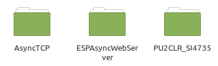

# Installation of libraries
 
 To install Si4735, ESPAsyncWebServer and AsyncTCP libraries. You just have to download the archive [libraries.zip](https://github.com/BenjaminNeveu/ESP32_Si4735_Control_by_WiFi/raw/master/libraries/libraries.zip) .
|  |  |
|--|--|
| Once downloaded, you must extract the file   present in the archive. The file ``libraries``  contains three folders corresponding to the different libraries needed. ||

You have to copy the three folders in ``<home_dir>/Arduino/libraries``.
