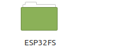

## Installation of SPIFFS

To install SPIFFS. You must first download the archive [tools.zip](https://github.com/BenjaminNeveu/ESP32_Si4735_Control_by_WiFi/raw/master/tools/tools.zip) .
|  |  |
|--|--|
| Once downloaded, you must extract the file present   in the archive. ||

and you just have to copy the folder ``ESP32FS`` to ``<home_dir>/Arduino/tools``. It is possible that the ``tools'' folder does not exist.
