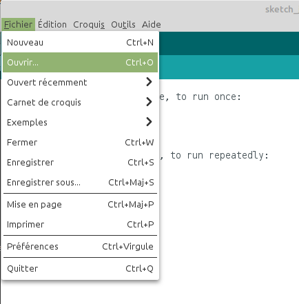

# Compiling with the Arduino IDE

To start, download the archive [softwares.zip](https://github.com/BenjaminNeveu/ESP32_Si4735_Control_by_WiFi/raw/master/softwares/softwares.zip) containing all realised projects.

Once downloaded please extract the archive to ``<home_dir>/Arduino``

|  |  |
|--|--|
| Here are the contents of the ``Arduino`` folder if you haven't<br> made any other programs before |  |

Here is the file tree obtained after all the steps have been completed:

```
[<home_dir>/Arduino]
              |
              |----[librairies]
              |         |
              |         |--------[AsyncTCP]
              |         |--------[ESPAsyncWebServer]
              |         |--------[PU2CLR_SI4735]
              |
              |----[softwares]
              |         |
              |         |--------[ESP32_Broadcast]
              |         |--------[ESP32_SSB]
              |         |--------[Format_SPIFFS]
              |
              |----[tools]
                        |
                        |--------[ESP32FS]
```

## Compilation of Format_SPIFFS 

It is recommended to start with this program so that the HMI (Human Machine Interface) works correctly, because it allows to format the flash memory of the ESP32.

|  |  |
|--|--|
|Click on ``File`` and then on ``Open``.<br><br>Select the file ``Format_SPIFFS.ino``.<br><br>Which is located in : <br> ``<home_dir>/Arduino/softwares/Format_SPIFFS`` | |

|  |  |
|--|--|
|You just have to upload this program to the ESP32. <br>It is possible that the program does not compile.<br> If this happens, you must press the ``BOOT`` button <br> on your ESP32 when uploading.||

Once the program is uploaded, I suggest you open the serial monitor by clicking on ``Tools`` and then on ``Serial Monitor``, then press the ``RST``(reset) button on your ESP32, to verify that the memory formatting has been done correctly.

|  |  |
|--|--|
|||


## Compilation of ESP32_SSB 

Open the file ``ESP32_SSB.ino`` which is situated in ``<home_dir>/Arduino/softwares/ESP32_SSB``, then upload it to your ESP32.

|  |  |
|--|--|
|Once the program is compiled, you will upload the content <br> ``data`` directory which contains the HMI (Human Machine Interface),<br> for this you will click on ``Tools`` then on <br> ``ESP32 Sketch Data Upload``||
