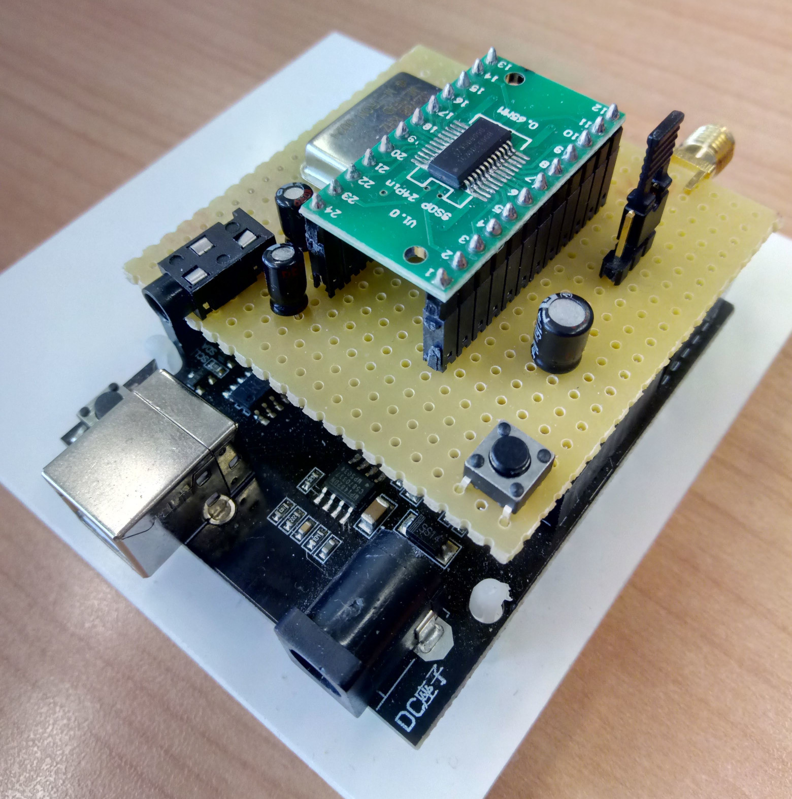
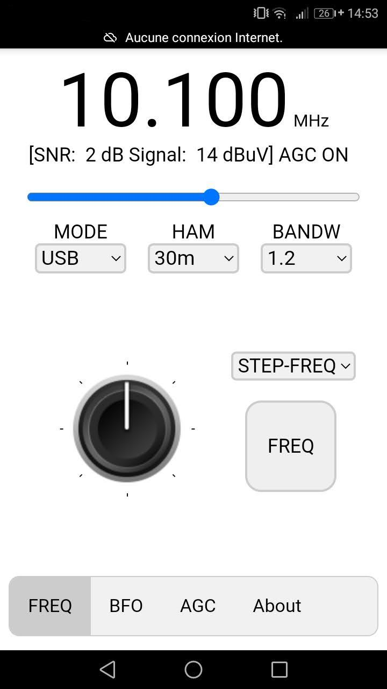
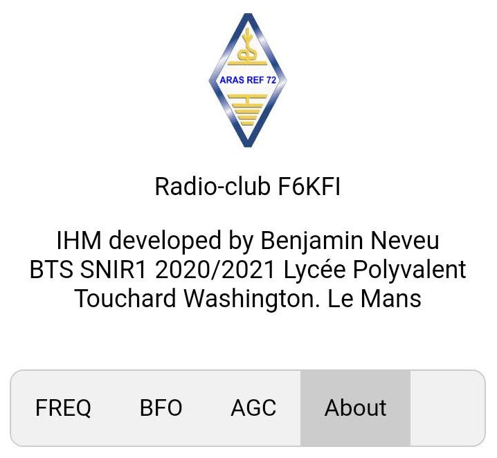
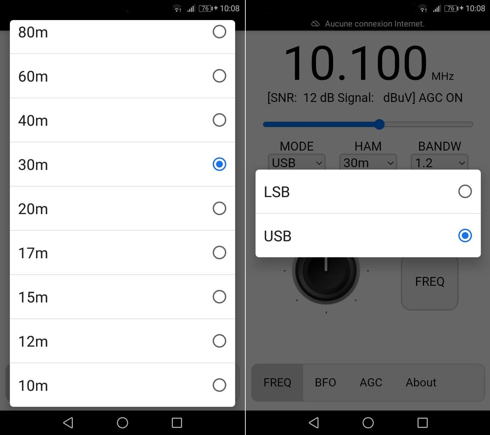
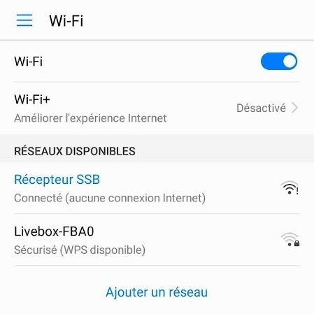

# SSB receiver controlled by smartphone
Student in IT at Touchard Washington high school in Le Mans, I carried out an internship of 6 weeks at the radio club F6KFI of Le Mans. My internship subject was to program a man-machine interface of an SSB receiver with the SI4735 integrated circuit as a base.

 1. [Presentation](https://github.com/BenjaminNeveu/ESP32_Si4735_Control_by_WiFi/tree/master/EN#Presentation)
 2. [Interface description](https://github.com/BenjaminNeveu/ESP32_Si4735_Control_by_WiFi/tree/master/EN#Interface-description)
 3. [Description of the libraries used](https://github.com/BenjaminNeveu/ESP32_Si4735_Control_by_WiFi/tree/master/EN#Description-of-the-libraries-used)
 4. [Description of SPIFFS](https://github.com/BenjaminNeveu/ESP32_Si4735_Control_by_WiFi/tree/master/EN#Description-of-SPIFFS)
 5. [Start-up procedure](https://github.com/BenjaminNeveu/ESP32_Si4735_Control_by_WiFi/tree/master/EN#Start-up-procedure)

## Presentation

 The objective of my project is simple, to control the receiver with a smartphone rather than a touch LCD display. For this, I designed a HMI (Human Machine Interface) with a Wi-Fi access point and a web page. It would have been possible to make an Android application. However, the use of a web server directly integrated in the ESP32 microcontroller allows a more versatile use of different brands of smartphones. 

|  |  |
|--|--|
| The SSB receiver is composed of an ESP32 and a Si4735 integrated  circuit. Most of the time, this component (which costs only a few euros)  is controlled by an Arduino and a touch screen. The program I made allows to control  the receiver with a simple smartphone. This reduces the cost, the complete  receiver is reduced to a microcontroller ESP32 (equipped with a WiFi access point) and the SI4735. To program the ESP32 with a Si4735 I used the [Si4735](https://github.com/pu2clr/SI4735) library of PU2CLR which is very complete and very well described.|    Prototype used during my intership |

 SSB reception is made possible by a micro-code that is downloaded into the SI4735 at power-on. The integrated circuit works in the same way as an SDR (Software Defined Radio) receiver without the need for a computer. The selection of the reception frequency and the reception mode is done by the microcontroller via the I²C bus. The microcontroller does not realize audio processing, it is only used to control the SI4735 and to host the WEB page (the control interface of my project). The local oscillator is clocked by a quartz of 32768 Hz. 

## Interface description

 The programming was done with the Arduino IDE and Netbeans in C++. The web page uses JavaScript code and automatically dialogues with the ESP32 acting as an interface between the smartphone and the SI4735 receiver. The user has only one web page with different tabs. 

|  |  |
|--|--|
|  |  In the upper part of the HMI, we find the main information :   - Frequency ;  - Signal to noise ratio (SNR) ;  - RSSI (Received Signal Strength Indicator);  - The status of AGC on or off ;  - A slider for volume control ;  Just below, there are three drop-down lists that allow you to choose the mode ( LSB, USB ), the different bands (10m to 630m ), then the bandwidth in BANDW listening ( 0,5 ; 1,0 ; 2,2 ; 3,0 ; 4,0 KHz ).  There are 4 tabs:   - The " FREQ " tab is composed of a rotary knob which is reminiscent of the one present in any conventional receiver. This one allows you to increment or decrement the frequency with a step that you can select right next to it in the " STEP-FREQ " drop-down list (1 kHz; 5 kHz), the " FREQ " button allows you to directly enter the frequency you wish to listen to.   - LThe " BFO " tab has the same elements as the " FREQ " tab. This allows you to adjust the frequency more precisely according to the step selected via the " STEP-BFO " selection (1 Hz; 5 Hz; 10 Hz; 25 Hz). The " Reset " button allows you to reset the BFO setting.   - The " AGC " tab allows you to activate or deactivate the automatic gain control.   - The "About" tab: Author of the program.  |
|  &nbsp;&nbsp;&nbsp;&nbsp;&nbsp;&nbsp;&nbsp;&nbsp;&nbsp;&nbsp;&nbsp;&nbsp;&nbsp;&nbsp;&nbsp;&nbsp;&nbsp;&nbsp;&nbsp;&nbsp;&nbsp;&nbsp;&nbsp;&nbsp;&nbsp;&nbsp;&nbsp;&nbsp;&nbsp;&nbsp;&nbsp;&nbsp;&nbsp;&nbsp;&nbsp;&nbsp;&nbsp;&nbsp;&nbsp;&nbsp;&nbsp;&nbsp;&nbsp;&nbsp;&nbsp;&nbsp;&nbsp;&nbsp;&nbsp;&nbsp;&nbsp;&nbsp;&nbsp;&nbsp;&nbsp;&nbsp;&nbsp;&nbsp;&nbsp;&nbsp;&nbsp;&nbsp;&nbsp;&nbsp;&nbsp;&nbsp;&nbsp;&nbsp;&nbsp;&nbsp;&nbsp;&nbsp;&nbsp;&nbsp;&nbsp;&nbsp;| |

## Description of the libraries used

For this project I used three libraries :

 - [PU2CLR_Si4735](https://github.com/pu2clr/SI4735) 
 - [ESPAsyncWebServer](https://github.com/me-no-dev/ESPAsyncWebServer)
 - [AsyncTCP](https://github.com/me-no-dev/AsyncTCP)

The web server part was made with the ESPAsyncWebServer library, which needs the AsyncTCP library to work. I first used the WebServer library but it was not adapted because it did not manage asynchronous requests to get the data and display them on the HMI (Human Machine Interface). The ESPAsyncWebServer library was suitable because it manages different types of requests (GET and POST).

## Description of SPIFFS

During this project I used the SPIFFS tool, the main advantage of having used this tool is that instead of placing the code of my web page in a variable, I was able to directly create an HTML, Javascript and Css file in a file named data, which allows me to have a more complete display of my code by using the Netbeans IDE for the web part, and moreover it allowed me to integrate images.

## Start-up procedure

 1. [Configuration of the Arduino IDE for the ESP32](https://github.com/BenjaminNeveu/ESP32_Si4735_Control_by_WiFi/tree/master/EN/01_Configuration_Arduino_IDE)
 2. [Installation of libraries](https://github.com/BenjaminNeveu/ESP32_Si4735_Control_by_WiFi/tree/master/EN/02_Installation_of_libraries)  
 3. [Installation of SPIFFS](https://github.com/BenjaminNeveu/ESP32_Si4735_Control_by_WiFi/tree/master/EN/03_Installation_of_SPIFFS)
 4. [Compilation of programs](https://github.com/BenjaminNeveu/ESP32_Si4735_Control_by_WiFi/tree/master/EN/04_Compilation_of_programs)

|  |  |
|--|--|
|Once the program is present in your ESP32, you just have to connect  to the receiver, for that you just have to go in your Wi-Fi settings and  select ``Récepteur SSB``. (there is no password)   Once connected you can go to a web browser and write in the   address bar ``192.168.4.1`` (corresponds to the default IP address of the ESP) to access the interface.    ||
