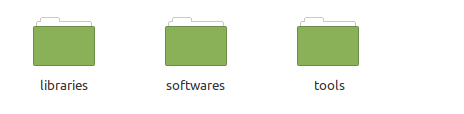
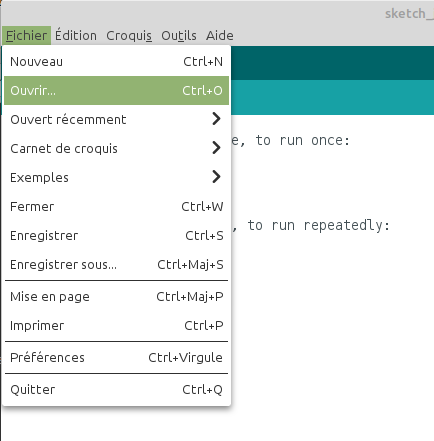
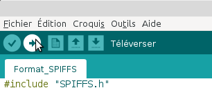
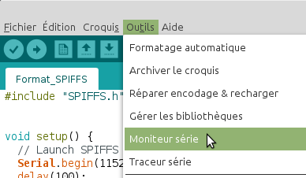
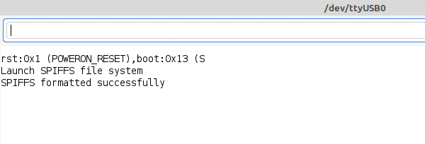
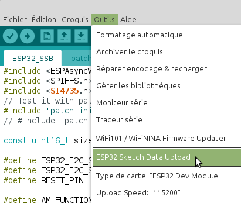

# Compilation avec l'IDE Arduino 

Pour commencer, téléchargé l'archive [softwares.zip](https://github.com/BenjaminNeveu/ESP32_Si4735_Control_by_WiFi/raw/master/softwares/softwares.zip) contenant tous les projets réalisés.

Une fois téléchargé veuillez extraire l'archive vers ``<home_dir>/Arduino``

|  |  |
|--|--|
| Voici le contenu du dossier ``Arduino`` si vous n'avez<br> pas fait d'autres programmes auparavant |  |

Voici l'arborescence de fichier obtenue une fois toutes les étapes réalisées :

```
[<home_dir>/Arduino]
              |
              |----[librairies]
              |         |
              |         |--------[AsyncTCP]
              |         |--------[ESPAsyncWebServer]
              |         |--------[PU2CLR_SI4735]
              |
              |----[softwares]
              |         |
              |         |--------[ESP32_Broadcast]
              |         |--------[ESP32_SSB]
              |         |--------[Format_SPIFFS]
              |
              |----[tools]
                        |
                        |--------[ESP32FS]
```

## Compilation de Format_SPIFFS 

Il est conseillé de commencer par ce programme pour que l'IHM (Interface Homme Machine) fonctionne correctement, parce qu'il permet de formater la mémoire flash de L'ESP32.

|  |  |
|--|--|
|Cliquez sur ``Fichier`` puis sur ``Ouvrir``<br><br>Sélectionnez le fichier ``Format_SPIFFS.ino``.<br><br>Qui se situe dans : <br> ``<home_dir>/Arduino/softwares/Format_SPIFFS`` | |

|  |  |
|--|--|
|Il vous reste plus qu'à téléverser ce programme sur l'ESP32. <br>Il est possible que le programme ne compile pas.<br> Si cela arrive il faut appuyer sur le bouton ``BOOT``<br> de votre ESP32 au moment du téléversement.||

Une fois le programme téléversé, je vous conseille d'ouvrir le moniteur série en cliquant sur ``Outils`` puis sur ``Moniteur série``, puis sur le bouton ``RST``(reset) de votre ESP32, pour vérifier que le formatage de la mémoire s'est réalisé correctement.

|  |  |
|--|--|
|||


## Compilation de ESP32_SSB 

Ouvrez le fichier ``ESP32_SSB.ino`` qui se situe dans ``<home_dir>/Arduino/softwares/ESP32_SSB``, puis téléversez le dans votre ESP32.

|  |  |
|--|--|
|Une fois le programme compilé, vous allez téléverser le contenu <br>du répertoire ``data`` qui contient l'IHM (Interface Homme Machine),<br> pour ceci vous allez cliquer sur ``Outils`` puis sur<br> ``ESP32 Sketch Data Upload``||
