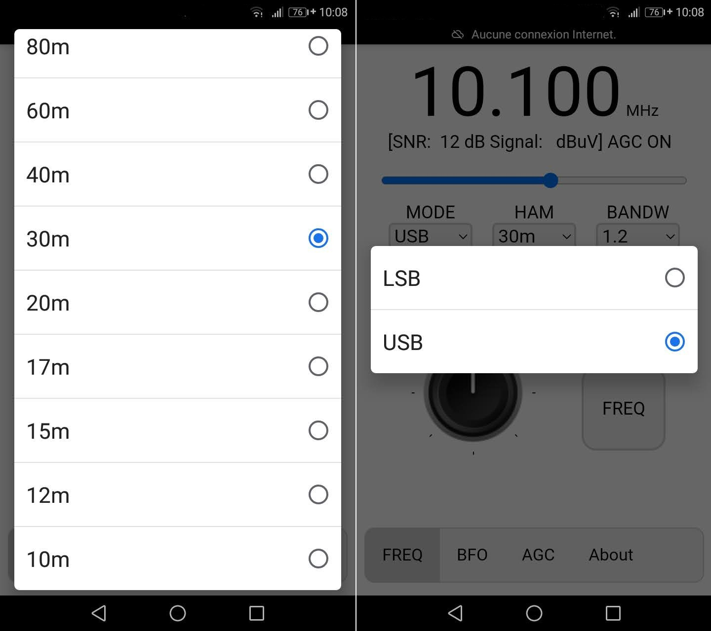
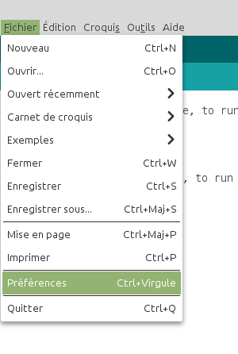

# Récepteur SSB contrôlé par smartphone
Étudiant en BTS informatique et réseau au lycée Touchard Washington au Mans, j’ai effectué un stage de 6 semaines au radio-club F6KFI du Mans. Mon sujet de stage avait pour objectif de programmer une interface homme machine d’un récepteur SSB avec comme base le circuit intégré SI4735.

 1. [Présentation](https://github.com/BenjaminNeveu/ESP32_Si4735_Control_by_WiFi/tree/master/FR#pr%C3%A9sentation)
 2. [Description de l'interface](https://github.com/BenjaminNeveu/ESP32_Si4735_Control_by_WiFi/tree/master/FR#Description-de-linterface)
 3. [Configuration de l'IDE Arduino pour l'ESP32](https://github.com/BenjaminNeveu/ESP32_Si4735_Control_by_WiFi/tree/master/FR/01_Configuration_IDE_Arduino)
 4. [Installation des bibliothèques](https://github.com/BenjaminNeveu/ESP32_Si4735_Control_by_WiFi/tree/master/FR#installation-des-librairies)  
 5. [Installation de SPIFFS](https://github.com/BenjaminNeveu/ESP32_Si4735_Control_by_WiFi/tree/master/FR#installation-de-spiffs)
 6. [Compilation avec l'IDE Arduino](https://github.com/BenjaminNeveu/ESP32_Si4735_Control_by_WiFi/tree/master/FR#compilation-avec-lide-arduino)
 7. [Connection au récepteur](https://github.com/BenjaminNeveu/ESP32_Si4735_Control_by_WiFi/tree/master/FR#connection-au-r%C3%Acepteur)

## Présentation

<br>L’objectif de mon projet est simple contrôler le récepteur avec un smartphone plutôt qu’un afficheur. Pour cela, je dois concevoir une IHM (interface homme machine) à l’aide d’un point d’accès WiFi et d’une page web. Il aurait été possible de réaliser une application dédiée pour Android. Mais utilisation d'un serveur web directement intégré dans le microcontrôleur ESP32 permet une utilisation plus polyvalente des différentes marques de smartphones.<br>

|  |  |
|--|--|
| Le récepteur SSB est composé d'un ESP32 et d'un circuit intégré Si4735. <br> La plupart du temps, ce composant (qui ne coûte que quelques euros) <br> est piloté par un Arduino et un écran tactile. Le programme que j’ai <br> réalisé a pour but de contrôler le récepteur avec un simple smartphone. <br> Cela permet ainsi de réduire les coûts, le récepteur complet étant réduit à un microcontrôleur ESP32 (muni d’un point d’accès WiFi) et le SI4735. Pour programmer l'ESP32 avec un Si4735 j'ai utilisé la bibliothèque de [PU2CLR](https://github.com/pu2clr/SI4735) qui est très complète et très bien décrite par ailleurs il recense également différents projets sur son site |  <br> Prototype utilisé lors du stage |

<br>La réception de la SSB est rendue possible grâce à un micro code téléchargé dans le si4735 à la mise sous tension. Le circuit intégré fonctionne de la même manière qu’un récepteur SDR (Radio Logicielle) classique sans avoir besoin d’un ordinateur. La sélection de la fréquence de réception ainsi que le mode de réception sont réalisés par un microcontrôleur via un bus I²C. Le microcontrôleur ne réalise aucun traitement audio, il est seulement utilisé pour commander le SI4735 et héberger la page WEB (L’interface de contrôle de mon projet). L’oscillateur local est cadencé par un quartz de 32768 Hz.<br>

## Description de l'interface

<br>La programmation a été réalisée avec l’IDE Arduino pour la partie en C++ de part l'utilisation de SPIFFS, qui permet l'intégration des fichier réalisé avec Netbeans (HTML,CSS,Javascript) dans la mémoire flash de l'ESP et qu'ils soient utilisable par le serveur web. La page web utilise du code JavaScript et dialogue automatiquement avec l’ESP32 assurant le rôle d’interface entre le smartphone et le récepteur SI4735. L’utilisateur ne dispose que d’une seule page web avec différents onglets.<br>

|  |  |
|--|--|
|  |<br><br>Dans la partie supérieure de l’IHM, on retrouve les informations principales :<br><br> - La fréquence ;<br> - Le rapport signal sur bruit (SNR) ;<br> - Le RSSI (Received Signal Strength Indicator) ;<br> - L’état de AGC on ou off ;<br> - Un « slider » pour le contrôle du volume ;<br><br>Juste en dessous, on dispose de trois listes déroulantes qui permettent de choisir le mode (LSB, USB), les différentes bandes (10m à 630m), puis la bande passante en écoute BANDW (0,5 ; 1,0 ; 2,2 ; 3,0 ; 4,0 KHz).<br><br>On retrouve ensuite 4 onglets spécifiques : <br><br> - L’onglet « FREQ » est composé d’un bouton rotatif qui rappelle celui présent dans tout récepteur conventionnel. Celui-ci permet d’incrémenter ou décrémenter la fréquence avec un pas que l’on peut sélectionner juste à côté dans la liste déroulante « STEP-FREQ » (1 kHz ; 5 kHz), le bouton « FREQ » permet de saisir directement la fréquence que l’on souhaite écouter.<br><br> - L’onglet « BFO » possède les mêmes éléments que l’onglet « FREQ ». Cela permet de régler plus précisément la fréquence en fonction du pas choisi via la sélection de « STEP-BFO » (1 Hz; 5 Hz ; 10 Hz ; 25 Hz). Le bouton « Reset » permet de réinitialiser le réglage du BFO. <br><br> - L’onglet « AGC » permet d’activer ou de désactiver le contrôle automatique de gain.<br><br> - L’onglet « About » : Auteur du programme.<br><br>|
| <br>&nbsp;&nbsp;&nbsp;&nbsp;&nbsp;&nbsp;&nbsp;&nbsp;&nbsp;&nbsp;&nbsp;&nbsp;&nbsp;&nbsp;&nbsp;&nbsp;&nbsp;&nbsp;&nbsp;&nbsp;&nbsp;&nbsp;&nbsp;&nbsp;&nbsp;&nbsp;&nbsp;&nbsp;&nbsp;&nbsp;&nbsp;&nbsp;&nbsp;&nbsp;&nbsp;&nbsp;&nbsp;&nbsp;&nbsp;&nbsp;&nbsp;&nbsp;&nbsp;&nbsp;&nbsp;&nbsp;&nbsp;&nbsp;&nbsp;&nbsp;&nbsp;&nbsp;&nbsp;&nbsp;&nbsp;&nbsp;&nbsp;&nbsp;&nbsp;&nbsp;&nbsp;&nbsp;&nbsp;&nbsp;&nbsp;&nbsp;&nbsp;&nbsp;&nbsp;&nbsp;&nbsp;&nbsp;&nbsp;&nbsp;&nbsp;&nbsp;&nbsp;&nbsp;&nbsp;&nbsp;&nbsp;&nbsp;| |

## Configuration de l'IDE Arduino pour l'ESP32

Cliquez sur le menu ``Fichier`` puis sur ``Préférences``.

Entrer l’URL suivante dans URL de gestionnaire de cartes supplémentaires.
	
	https://dl.espressif.com/dl/package_esp32_index.json

|  |  |
|--|--|
|  |  |

Ouvrez maintenant le gestionnaire de carte en cliquant sur le menu ``Outils`` puis sur ``Type de carte`` puis sur ``Gestionnaire de carte``.

Écrivez ``esp32`` dans ``filtrez votre recherche``, choisissez ``esp32`` et cliquez sur ``Installer``.

|  |  |
|--|--|
|  |  |

Cliquez sur le menu ``Outils`` puis dans ``Type de carte``, choisissez ``ESP32 Arduino`` puis ``ESP32 Dev Module`` .

## Installation des librairies

Pour ce projet j'ai utilisé trois librairies :

 - [PU2CLR_Si4735](https://github.com/pu2clr/SI4735) 
 - [ESPAsyncWebServer](https://github.com/me-no-dev/ESPAsyncWebServer)
 - [AsyncTCP](https://github.com/me-no-dev/AsyncTCP)
 
 Pour installer les librairies Si4735, ESPAsyncWebServer et AsyncTCP. Il suffit de télécharger l'archive [libraries.zip](https://github.com/BenjaminNeveu/ESP32_Si4735_Control_by_WiFi/raw/master/libraries/libraries.zip) .
|  |  |
|--|--|
| Une fois extrait, vous obtiendrez <br> un répetoire ``libraries`` contenant <br> les dossiers ci-contre. ||

Il vous reste juste a copié les trois dossiers dans ``<home_dir>/Arduino/libraries``.

## Installation de SPIFFS

Pour installer SPIFFS. Il vous suffit de télécharger l'archive [tools.zip](https://github.com/BenjaminNeveu/ESP32_Si4735_Control_by_WiFi/raw/master/tools/tools.zip) .
|  |  |
|--|--|
| Une fois extrait, vous obtiendrez un répertoire <br>``tools`` contenant  le dossier ci-contre. ||

Il vous reste juste a copier le dossier ````ESP32FS```` dans ``<home_dir>/Arduino/tools``. Il est possible que le dossier ``tools`` n'existe pas encore, il faut donc le créer si c'est le cas.

## Compilation avec l'IDE Arduino 

Pour compiler l'ESP32, je vous conseille de télécharger l'archive [programmes.zip](https://github.com/BenjaminNeveu/ESP32_Si4735_Control_by_WiFi/raw/master/progammes/programmes.zip) qui contient tous les programmes.

Une fois téléchargé veuillez extraire l'archive vers ``<home_dir>/Arduino``

|  |  |
|--|--|
| Voici le contenu du dossier ``Arduino`` si vous n'avez<br> pas fait d'autres programmes auparavant |  |

### Compilation de Format_SPIFFS 

Il est obligatoire commencer par ce programme pour que l'IHM (Interface Homme Machine) fonctionne correctement, parce qu'il permet de formater la mémoire de L'ESP32.

|  |  |
|--|--|
|Cliquez sur ``Fichier`` puis sur ``Ouvrir``<br><br>Sélectionnez le fichier ``Format_SPIFFS.ino``.<br><br>qui se situe dans : <br> ``<home_dir>/Arduino/programmes/Format_SPIFFS`` | |

Avant de téléverser le programme, je vous conseille d'ouvrir le moniteur série en cliquant sur ``Outils`` puis sur ``Moniteur Série``, pour vérifier que le formatage de la mémoire s'est réalisé correctement.

|  |  |
|--|--|
|||

|  |  |
|--|--|
|Il vous reste plus qu'à téléverser ce programme sur l'ESP32||

### Compilation de ESP32_SSB 

Ouvrez le fichier ``ESP32_SSB.ino`` qui se situe dans ``<home_dir>/Arduino/programmes/ESP32_SSB``, téléversez le dans votre ESP32.

|  |  |
|--|--|
|Une fois le programme compilé, vous allez téléverser le contenu <br>du répertoire ``data`` qui contient l'IHM (Interface Homme Machine),<br> pour ceci vous allez cliquer sur ``Outils`` puis sur<br> ``ESP32 Sketch Data Upload``||

## Connection au récepteur

|  |  |
|--|--|
|Pour se connecter au récepteur, il vous suffit d'allez dans vos <br>paramètres Wi-Fi et de sélectionner ``Récepteur SSB``. <br>(il n'y a pas de mots de passe)<br><br> Une fois connecté vous pouvez allez sur un navigateur et écrire<br> dans la barre d'adresse ``192.168.4.1`` pour accéder à l'interface <br><br> ||
