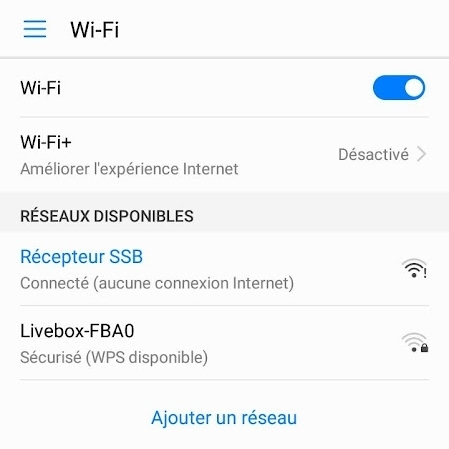

# Récepteur SSB contrôlé par smartphone
Étudiant en BTS informatique et réseau au lycée Touchard Washington au Mans, j’ai effectué un stage de 6 semaines au radio-club F6KFI du Mans. Mon sujet de stage avait pour objectif de programmer une interface homme machine d’un récepteur SSB avec comme base le circuit intégré SI4735.

 1. [Présentation](https://github.com/BenjaminNeveu/ESP32_Si4735_Control_by_WiFi/tree/master/FR#pr%C3%A9sentation)
 2. [Description de l'interface](https://github.com/BenjaminNeveu/ESP32_Si4735_Control_by_WiFi/tree/master/FR#Description-de-linterface)
 3. [Description des Bibliothéques utilisées](https://github.com/BenjaminNeveu/ESP32_Si4735_Control_by_WiFi/tree/master/FR#Description-des-bibliothèques)
 4. [Description de SPIFFS](https://github.com/BenjaminNeveu/ESP32_Si4735_Control_by_WiFi/tree/master/FR#Description-de-SPIFFS)
 5. [Procédure de mise en fonctionnement](https://github.com/BenjaminNeveu/ESP32_Si4735_Control_by_WiFi/tree/master/FR#Procédure-de-mise-en-fonctionnement)

## Présentation

 L’objectif de mon projet est simple contrôler le récepteur avec un smartphone plutôt qu’un afficheur. Pour cela, je dois concevoir une IHM (interface homme machine) à l’aide d’un point d’accès WiFi et d’une page web. Il aurait été possible de réaliser une application dédiée pour Android. Mais utilisation d'un serveur web directement intégré dans le microcontrôleur ESP32 permet une utilisation plus polyvalente des différentes marques de smartphones. 

|  |  |
|--|--|
| Le récepteur SSB est composé d'un ESP32 et d'un circuit intégré Si4735.   La plupart du temps, ce composant (qui ne coûte que quelques euros)   est piloté par un Arduino et un écran tactile. Le programme que j’ai   réalisé a pour but de contrôler le récepteur avec un simple smartphone.   Cela permet ainsi de réduire les coûts, le récepteur complet étant réduit à un microcontrôleur ESP32 (muni d’un point d’accès WiFi) et le SI4735. Pour programmer l'ESP32 avec un Si4735 j'ai utilisé la bibliothèque de [PU2CLR](https://github.com/pu2clr/SI4735) qui est très complète et très bien décrite par ailleurs il recense également différents projets sur son site. |    Prototype utilisé lors du stage |

 La réception de la SSB est rendue possible grâce à un micro code téléchargé dans le si4735 à la mise sous tension. Le circuit intégré fonctionne de la même manière qu’un récepteur SDR (Radio Logicielle) classique sans avoir besoin d’un ordinateur. La sélection de la fréquence de réception ainsi que le mode de réception sont réalisés par un microcontrôleur via un bus I²C. Le microcontrôleur ne réalise aucun traitement audio, il est seulement utilisé pour commander le SI4735 et héberger la page WEB (L’interface de contrôle de mon projet). L’oscillateur local est cadencé par un quartz de 32768 Hz. 

## Description de l'interface

 La programmation a été réalisée avec l’IDE Arduino pour la partie en C++ et avec Netbeans pour la partie web (HTML,CSS,Javascript). La page web utilise du code JavaScript et dialogue automatiquement avec l’ESP32 assurant le rôle d’interface entre le smartphone et le récepteur SI4735. L’utilisateur ne dispose que d’une seule page web avec différents onglets pour contrôler l'ESP. 

|  |  |
|--|--|
|  |  Dans la partie supérieure de l’IHM, on retrouve les informations principales :   - La fréquence ;  - Le rapport signal sur bruit (SNR) ;  - Le RSSI (Received Signal Strength Indicator) ;  - L’état de AGC on ou off ;  - Un « slider » pour le contrôle du volume ;  Juste en dessous, on dispose de trois listes déroulantes qui permettent de choisir le mode (LSB, USB), les différentes bandes (10m à 630m), puis la bande passante en écoute BANDW (0,5 ; 1,0 ; 2,2 ; 3,0 ; 4,0 KHz).  On retrouve ensuite 4 onglets spécifiques :    - L’onglet « FREQ » est composé d’un bouton rotatif qui rappelle celui présent dans tout récepteur conventionnel. Celui-ci permet d’incrémenter ou décrémenter la fréquence avec un pas que l’on peut sélectionner juste à côté dans la liste déroulante « STEP-FREQ » (1 kHz ; 5 kHz), le bouton « FREQ » permet de saisir directement la fréquence que l’on souhaite écouter.   - L’onglet « BFO » possède les mêmes éléments que l’onglet « FREQ ». Cela permet de régler plus précisément la fréquence en fonction du pas choisi via la sélection de « STEP-BFO » (1 Hz; 5 Hz ; 10 Hz ; 25 Hz). Le bouton « Reset » permet de réinitialiser le réglage du BFO.    - L’onglet « AGC » permet d’activer ou de désactiver le contrôle automatique de gain.   - L’onglet « About » : Auteur du programme.  |
|  &nbsp;&nbsp;&nbsp;&nbsp;&nbsp;&nbsp;&nbsp;&nbsp;&nbsp;&nbsp;&nbsp;&nbsp;&nbsp;&nbsp;&nbsp;&nbsp;&nbsp;&nbsp;&nbsp;&nbsp;&nbsp;&nbsp;&nbsp;&nbsp;&nbsp;&nbsp;&nbsp;&nbsp;&nbsp;&nbsp;&nbsp;&nbsp;&nbsp;&nbsp;&nbsp;&nbsp;&nbsp;&nbsp;&nbsp;&nbsp;&nbsp;&nbsp;&nbsp;&nbsp;&nbsp;&nbsp;&nbsp;&nbsp;&nbsp;&nbsp;&nbsp;&nbsp;&nbsp;&nbsp;&nbsp;&nbsp;&nbsp;&nbsp;&nbsp;&nbsp;&nbsp;&nbsp;&nbsp;&nbsp;&nbsp;&nbsp;&nbsp;&nbsp;&nbsp;&nbsp;&nbsp;&nbsp;&nbsp;&nbsp;&nbsp;&nbsp;| |

## Description des bibliothèques

Pour ce projet j'ai utilisé trois bibliothèques :

 - [PU2CLR_Si4735](https://github.com/pu2clr/SI4735) 
 - [ESPAsyncWebServer](https://github.com/me-no-dev/ESPAsyncWebServer)
 - [AsyncTCP](https://github.com/me-no-dev/AsyncTCP)

La partie web serveur a été faites avec la librairie ``ESPAsyncWebServer``, qui a besoin de la bibliothèque ``AsyncTCP`` pour fonctionner. J'ai dans un premier temps utilisé la bibliothèque WebServeur mais elle ne convenait pas car elle ne gérait pas les requêtes asynchrones pour récupérer les données et les afficher sur l'IHM(Interface Homme Machine). La bibliothèque ``ESPAsyncWebServer`` me convenait du faite quelle gère différents types de requête, dans mon cas GET et POST.

## Description de SPIFFS

Lors de ce projet j'ai utilisé l'outil SPIFFS, le principale avantage d'avoir utilisé cet outil est qu'au lieu de placer le code de ma page web dans une variable, j'ai pu directement créer un fichier HTML, Javascript ou Css à coté de mon programme principal dans un fichier nommé data, ce qui permet d'avoir un affichage plus complet de mon code en utilisant l'IDE Netbeans pour la partie web, et de plus il m'a permit d'intégrater des image.

## Procédure de mise en fonctionnement

La mise en fonctionnement ce fait en plusieurs étapes:

 1. [Configuration de l'IDE Arduino pour l'ESP32](https://github.com/BenjaminNeveu/ESP32_Si4735_Control_by_WiFi/tree/master/FR/01_Configuration_IDE_Arduino)
 2. [Installation des bibliothèques](https://github.com/BenjaminNeveu/ESP32_Si4735_Control_by_WiFi/tree/master/FR/02_installation_des_bibliothèques)  
 3. [Installation de SPIFFS](https://github.com/BenjaminNeveu/ESP32_Si4735_Control_by_WiFi/tree/master/FR/03_installation_de_SPIFFS)
 4. [Compilation des programmes](https://github.com/BenjaminNeveu/ESP32_Si4735_Control_by_WiFi/tree/master/FR/04_compilation_des_programmes)

|  |  |
|--|--|
|Une fois le programme présent dans votre ESP32, il ne vous reste plus qu'a vous connecter au récepteur, pour cela il vous suffit d'allez dans vos  paramètres Wi-Fi et de sélectionner ``Récepteur SSB``.  (il n'y a pas de mots de passe)   Une fois connecté vous pouvez allez sur un navigateur web et écrire  dans la barre d'adresse ``192.168.4.1``(correspond a l'adresse IP par défaut de l'ESP) pour accéder à l'interface    ||
