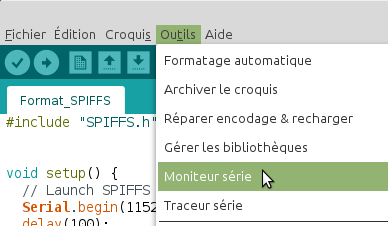
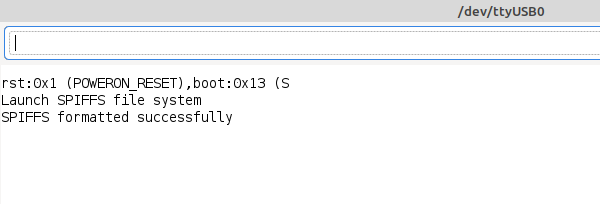
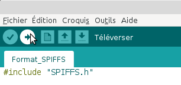
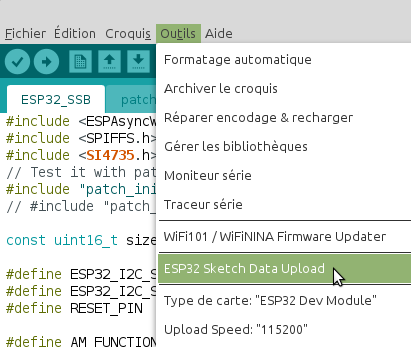
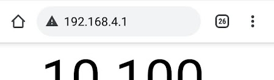

# Récepteur SSB contrôlé par smartphone
Étudiant en BTS informatique et réseau au Lycée Touchard Washington, au Mans. J'ai réalisé pendant mon stage au radio club F6KFI une IHM pour un récepteur SSB à base d'un SI4735.

 1. [Présentation](https://github.com/BenjaminNeveu/ESP32_Si4735_Control_by_WiFi/tree/master/FR#pr%C3%A9sentation)
 2. [Copies d'écran](https://github.com/BenjaminNeveu/ESP32_Si4735_Control_by_WiFi/tree/master/FR#copies-décran)
 3. [Configuration de l'IDE Arduino pour l'ESP32](https://github.com/BenjaminNeveu/ESP32_Si4735_Control_by_WiFi/tree/master/FR#configuration-de-lide-arduino-pour-lesp32)
 4. [Installation des librairies](https://github.com/BenjaminNeveu/ESP32_Si4735_Control_by_WiFi/tree/master/FR#installation-des-librairies)  
 5. [Installation de SPIFFS](https://github.com/BenjaminNeveu/ESP32_Si4735_Control_by_WiFi/tree/master/FR#installation-de-spiffs)
 6. [Compilation avec l'IDE Arduino](https://github.com/BenjaminNeveu/ESP32_Si4735_Control_by_WiFi/tree/master/FR#compilation-avec-lide-arduino)
 7. [Connection au récepteur](https://github.com/BenjaminNeveu/ESP32_Si4735_Control_by_WiFi/tree/master/FR#connection-au-récepteur)

## Présentation

|  |  |
|--|--|
| Le récepteur SSB est composé d'un ESP32 et d'un circuit intégré Si4735. <br> <br> Pour programmer l'ESP32 avec un Si4735 j'ai utilisé la librairie de [PU2CLR](https://github.com/pu2clr/SI4735) qui est très complète et très bien décrite| |

## Copies d'écran

|  |  |  |
|--|--|--|
|  |  |On peut voir sur la copie d'écran les <br>principales informations sur la partie supérieure de l'écran suivi de 3 listes déroulantes pour <br>sélectionner les différents paramètres <br> <hr>La patie inférieure est composé <br>de 4 onglets "FREQ", "BFO", "AGC" et "About"<br> <hr>Un bouton rotatif permet d’incrémenter ou décrémenter la fréquence.|

## Configuration de l'IDE Arduino pour l'ESP32

|  |  |
|--|--|
|  |  |

Entrer l’URL suivante dans URL de gestionnaire de cartes supplémentaires.
	
	https://dl.espressif.com/dl/package_esp32_index.json

|  |  |
|--|--|
|  |  |

Écrivez ``esp32`` dans ``filtrez votre recherche``. <br>Choisissez ``esp32`` et cliquez sur ``Installer``

Dans le menu ``Outil`` choisissez :
* Type de carte : ``ESP32 Aruino`` --> ``ESP32 Dev Module``

## Installation des librairies

Pour ce projet j'ai utilisé trois librairies :

 - [PU2CLR_Si4735](https://github.com/pu2clr/SI4735) 
 - [ESPAsyncWebServer](https://github.com/me-no-dev/ESPAsyncWebServer)
 - [AsyncTCP](https://github.com/me-no-dev/AsyncTCP)
 
 Pour installer les librairies Si4735, ESPAsyncWebServer et AsyncTCP. Il suffit de télécharger l'archive [libraries.zip](https://github.com/BenjaminNeveu/ESP32_Si4735_Control_by_WiFi/raw/master/FR/02_libraries/libraries.zip) .
|  |  |
|--|--|
| Une fois extrait, vous obtiendrez <br> un répetoire ``libraries`` contenant <br> les dossiers ci-contre. ||

Il vous reste juste a copié les trois dossiers dans ``<home_dir>/Arduino/libraries``.

## Installation de SPIFFS

Pour installer SPIFFS. Il vous suffit de télécharger l'archive [tools.zip](https://github.com/BenjaminNeveu/ESP32_Si4735_Control_by_WiFi/raw/master/FR/03_tools/tools.zip) .
|  |  |
|--|--|
| Une fois extrait, vous obtiendrez un répertoire <br>``tools`` contenant  le dossier ci-contre. ||

Il vous reste juste a copier le dossier ````ESP32FS```` dans ``<home_dir>/Arduino/tools``. Il est possible que le dossier ``tools`` n'existe pas encore, il faut donc le créer si c'est le cas.

## Compilation avec l'IDE Arduino 

Pour compiler l'ESP32, je vous conseille de télécharger l'archive [programmes.zip](https://github.com/BenjaminNeveu/ESP32_Si4735_Control_by_WiFi/raw/master/FR/01_progammes/programmes.zip) qui contient tous les programmes.

Une fois téléchargé veuillez extraire l'archive vers ``<home_dir>/Arduino``

|  |  |
|--|--|
| Voici le contenu du dossier ``Arduino`` si vous n'avez<br> pas fait d'autres programmes auparavant |  |

### Compilation de Format_SPIFFS 

Il est obligatoire commencer par ce programme pour que l'IHM (Interface Homme Machine) fonctionne correctement, parce qu'il permet de formater la mémoire de L'ESP32.

|  |  |
|--|--|
|Cliquez sur ``Fichier`` puis sur ``Ouvrir``<br><br>Sélectionnez le fichier ``Format_SPIFFS.ino``.<br><br>qui se situe dans : <br> ``<home_dir>/Arduino/programmes/Format_SPIFFS`` | |

Avant de téléverser le programme, je vous conseille d'ouvrir le moniteur série en cliquant sur ``Outils`` puis sur ``Moniteur Série``, pour vérifier que le formatage de la mémoire s'est réalisé correctement.

|  |  |
|--|--|
|||

|  |  |
|--|--|
|Il vous reste plus qu'à téléverser ce programme sur l'ESP32||

### Compilation de ESP32_SSB 

Ouvrez le fichier ``ESP32_SSB.ino`` qui se situe dans ``<home_dir>/Arduino/programmes/ESP32_SSB``, téléversez le dans votre ESP32.

|  |  |
|--|--|
|Une fois le programme compilé, vous allez téléverser le contenu <br>du répertoire ``data`` qui contient l'IHM (Interface Homme Machine),<br> pour ceci vous allez cliquer sur ``Outils`` puis sur<br> ``ESP32 Sketch Data Upload``||

## Connection au récepteur

|  |  |
|--|--|
|Pour se connecter au récepteur, il vous suffit d'allez dans vos <br>paramètres Wi-Fi et de sélectionner ``Récepteur SSB``. <br>(il n'y a pas de mots de passe)<br><br> Une fois connecté vous pouvez allez sur un navigateur et écrire<br> dans la barre d'adresse ``192.168.4.1`` pour accéder à l'interface <br><br> ||
