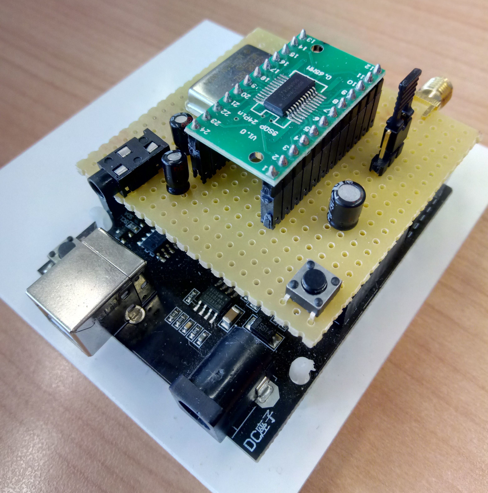
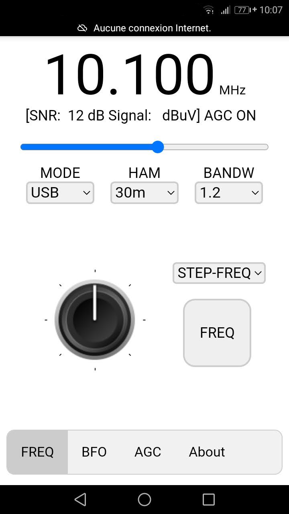
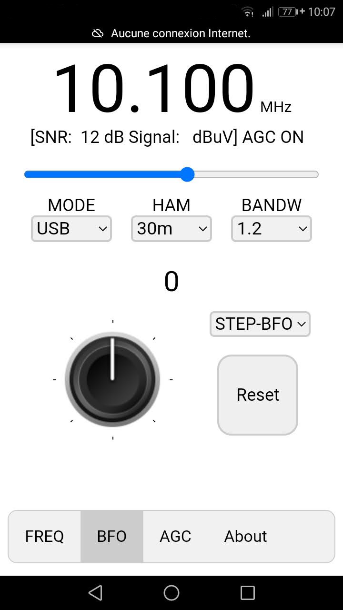
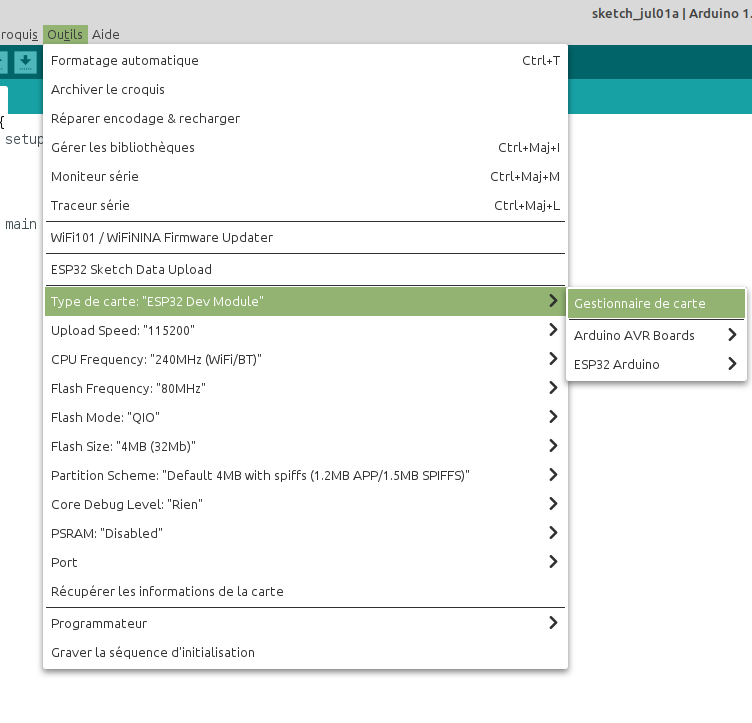
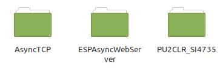
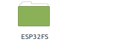

# Récepteur SSB contrôlé par smartphone
Étudiant en BTS informatique et réseau au Lycée Touchard Washington, à Le Mans. J'ai du lors de mon stage faire la conception d'une IHM pour un récepteur SSB.

 1. [Présentation](https://github.com/BenjaminNeveu/Stage-ESP32-Si4735#pr%C3%A9sentation)
 2. [Screenshot](https://github.com/BenjaminNeveu/Stage-ESP32-Si4735#screenshot)
 3. [Configuration de l'IDE Arduino pour l'ESP32](https://github.com/BenjaminNeveu/Stage-ESP32-Si4735#compilation-de-lide-arduino-pour-lesp32)
 4. [Installation des librairies](https://github.com/BenjaminNeveu/Stage-ESP32-Si4735#installation-des-librairies)  
 5. [Installation de SPIFFS](https://github.com/BenjaminNeveu/Stage-ESP32-Si4735#installation-de-spiffs)
 6. [Compilation avec l'IDE Arduino](https://github.com/BenjaminNeveu/Stage-ESP32-Si4735#compilation-avec-lide-arduino)

## Présentation

|  |  |
|--|--|
| La carte pour le projet est composé d'un ESP32 et d'un circuit intégré Si4735 <br> <br> Pour programmer programmer le Si4735 avec un ESP32 j'ai utiliser la librairie de  qui est très complète et très bien décrite| |


## Screenshot

|  |  |  |
|--|--|--|
|  |  |On peut voir sur le screenshot les <br>principale informations sur la partie supérieur de l'écren suivi de 3 liste déroulante pour <br>selectionné les différent paramétres <br> <hr>Dans la patie inférieur est <br>composé en 4 onglets 'FREQ', 'BFO', 'AGC' et 'About' qui comporte un bouton ratatif dans freq et bfo qui sert a incrémenter ou a désincrémenter <br><br>|

## Configuration de l'IDE Arduino pour l'ESP32

|  |  |
|--|--|
|  |  |

Entrer l’URL suivante dans URL de gestionnaire de cartes supplémentaires.
	
	https://dl.espressif.com/dl/package_esp32_index.json

|  |  |
|--|--|
|  |  |

Écrivez ```esp32``` dans filtrez votre recherche. <br>Choisissez ```esp32``` et cliquez sur ``Installer``

Dans le menu ``Outil`` choisissez :
* Type de carte ``ESP32 Dev Module``

## Installation des librairies

 -  
 - 
 - 
 
 Pour installer les librairies Si4735, ESPAsyncWebServer et AsyncTCP. Il vous suffit de télécharger l'archive  .
|  |  |
|--|--|
| Une fois extrait vous obtiendrez <br> un fichier ````libraries```` contenant <br> les dossiers ci-contre. ||

Il vous reste juste a copié les trois dossiers dans ````<home_dir>/Arduino/libraries````.

## Installation de SPIFFS

Pour installer les librairies Si4735, ESPAsyncWebServer et AsyncTCP. Il vous suffit de télécharger l'archive <br> .
|  |  |
|--|--|
| Une fois extrait vous obtiendrez <br>un fichier ````tools```` contenant  le dossier ci-contre. ||

Il vous reste juste a copié le dossier ````ESP32FS```` dans ````<home_dir>/Arduino/tools````. Il se peut que le dossier ```tools``` n'existe pas encore, il suffit de le crée.


## Compilation avec l'IDE Arduino

Pour compiler l'ESP32, je vous conseil de télécharger l'archive  qui contient tout les projet nécessaire.

Une fois télécharger veuillez extraire l'archive vers ```<home_dir>/Arduino```

|  |  |
|--|--|
| Voici le contenu du dossier ``Arduino``<br> si vous n'avez pas fait d'autre projet auparavant |  |

### Compilation Format_SPIFFS

Il faut commencer par ce programme parce qu'il permet de formater la mémoire de L'ESP32, il est obligatoire de respecter cette étape pour que le projet fonctionne correctement.

|  |  |
|--|--|
|Cliquez sur ``Fichier`` puis sur ``Ouvrir``<br><br>Un gestionnaire de fichier se lancer<br><br>Selectionnez le fichier ```Format_SPIFFS.ino```<br>Qui ce situe dans :<br><br>``<home_dir>/Arduino/projets/Format_SPIFFS`` | |


il vous reste plus que a compiler ce premier programme

### Compilation ESP32_SSB
