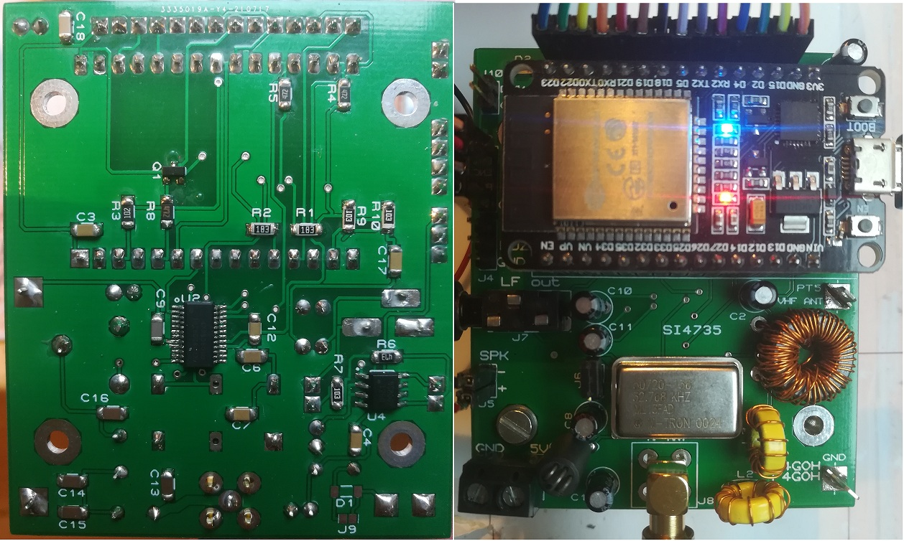
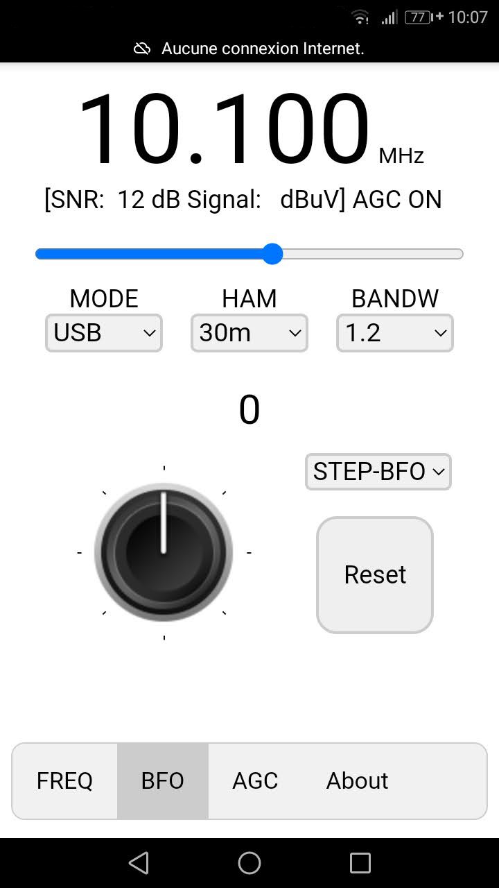
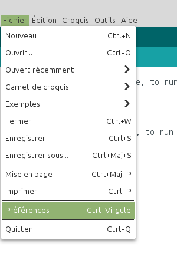
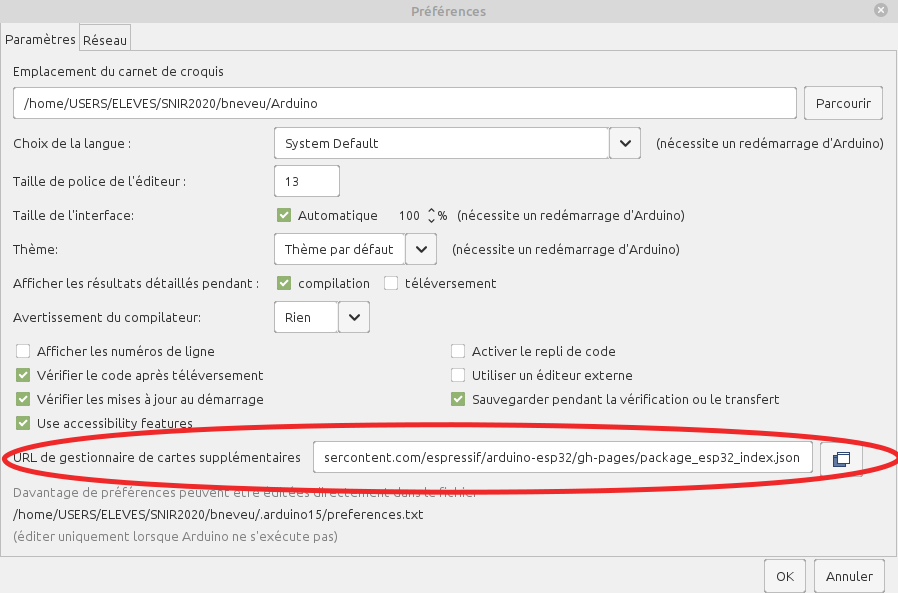
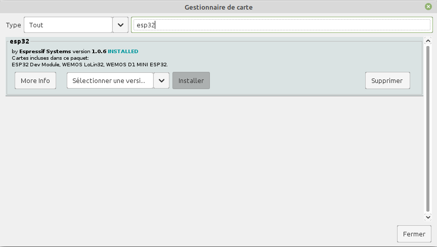
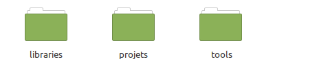
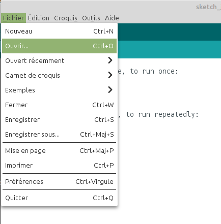

# Récepteur SSB contrôlé par smartphone
Étudiant en BTS informatique et réseau au Lycée Touchard Washington, à Le Mans. J'ai du lors de mon stage faire la conception d'une IHM pour un récepteur SSB. J'ai réalisé pendant mon stage au radio club F6KFI une IHM pour un récepteur SSB à base du SI4735.

 1. [Présentation](https://github.com/BenjaminNeveu/ESP32_Si4735_Control_by_WiFi#pr%C3%A9sentation)
 2. [Copies d'écran](https://github.com/BenjaminNeveu/ESP32_Si4735_Control_by_WiFi#copies-décran)
 3. [Configuration de l'IDE Arduino pour l'ESP32](https://github.com/BenjaminNeveu/ESP32_Si4735_Control_by_WiFi#configuration-de-lide-arduino-pour-lesp32)
 4. [Installation des librairies](https://github.com/BenjaminNeveu/ESP32_Si4735_Control_by_WiFi#installation-des-librairies)  
 5. [Installation de SPIFFS](https://github.com/BenjaminNeveu/ESP32_Si4735_Control_by_WiFi#installation-de-spiffs)
 6. [Compilation avec l'IDE Arduino](https://github.com/BenjaminNeveu/ESP32_Si4735_Control_by_WiFi#compilation-avec-lide-arduino)

## Présentation

|  |  |
|--|--|
| Le récepteur SSB est composé d'un ESP32 et d'un circuit intégré Si4735 <br> <br> Pour programmer le ESP32 avec un Si4735 j'ai utilisé la librairie de  qui est très complète et très bien décrite| |


## Copies d'écran

|  |  |  |
|--|--|--|
|  |  |On peut voir sur la copies d'écran les <br>principales informations sur la partie supérieur de l'écran suivi de 3 listes déroulantes pour <br>selectionner les différents paramètres <br> <hr>La patie inférieur est composé <br>de 4 onglets 'FREQ', 'BFO', 'AGC' et 'About'<br> <hr>Un bouton rotatif permet d’incrémenter ou décrémenter la fréquence.|

## Configuration de l'IDE Arduino pour l'ESP32

|  |  |
|--|--|
|  |  |

Entrer l’URL suivante dans URL de gestionnaire de cartes supplémentaires.
	
	https://dl.espressif.com/dl/package_esp32_index.json

|  |  |
|--|--|
|  |  |

Écrivez ```esp32``` dans filtrez votre recherche. <br>Choisissez ```esp32``` et cliquez sur ``Installer``

Dans le menu ``Outil`` choisissez :
* Type de carte ``ESP32 Dev Module``

## Installation des librairies

 -  
 - 
 - 
 
 Pour installer les librairies Si4735, ESPAsyncWebServer et AsyncTCP. Il suffit de télécharger l'archive  .
|  |  |
|--|--|
| Une fois extrait, vous obtiendrez <br> un répetoire ````libraries```` contenant <br> les dossiers ci-contre. ||

Il vous reste juste a copié les trois dossiers dans ````<home_dir>/Arduino/libraries````.

## Installation de SPIFFS

Pour installer SPIFFS. Il vous suffit de télécharger l'archive <br> .
|  |  |
|--|--|
| Une fois extrait, vous obtiendrez <br>un répertoire ````tools```` contenant  le dossier ci-contre. ||

Il vous reste juste a copié le dossier ````ESP32FS```` dans ````<home_dir>/Arduino/tools````. Il se peut que le dossier ```tools``` n'existe pas encore, il suffit de le créer.


## Compilation avec l'IDE Arduino

Pour compiler l'ESP32, je vous conseille de télécharger l'archive  qui contient tout les projets nécessaires.

Une fois téléchargé veuillez extraire l'archive vers ```<home_dir>/Arduino```

|  |  |
|--|--|
| Voici le contenu du dossier ``Arduino``<br> si vous n'avez pas fait d'autre projet auparavant |  |

### Compilation Format_SPIFFS

Il faut commencer par ce programme parce qu'il permet de formater la mémoire de L'ESP32, il est obligatoire de respecter cette étape pour que le projet fonctionne correctement.

|  |  |
|--|--|
|Cliquez sur ``Fichier`` puis sur ``Ouvrir``<br><br>Sélectionnez le fichier ```Format_SPIFFS.ino``` <br>Qui ce situe dans : <br><br> ``<home_dir>/Arduino/projets/Format_SPIFFS`` | |


Il vous reste plus qu'à compiler ce premier programme

### Compilation ESP32_SSB

La première parti est identiques a celle d'avant.
Après avoir compiler le programme nous allons compiler le fichier data en cliquant sur le menu ``Outils`` puis sur ``ESP32 Sketch Data Upload``.
